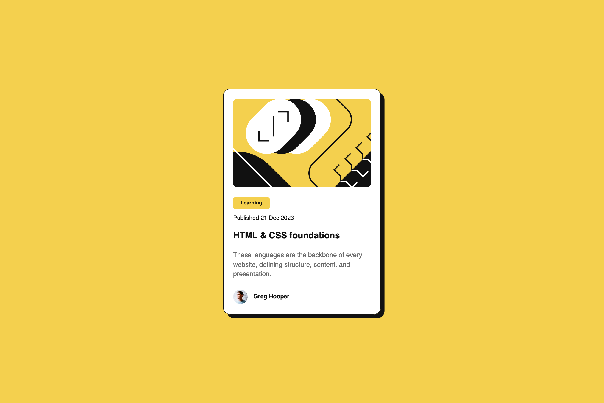

# Frontend Mentor - Blog preview card solution

This is a solution to the [Blog preview card challenge on Frontend Mentor](https://www.frontendmentor.io/challenges/blog-preview-card-ckPaj01IcS). Frontend Mentor challenges help you improve your coding skills by building realistic projects. 

## Table of contents

- [Overview](#overview)
  - [The challenge](#the-challenge)
  - [Screenshot](#screenshot)
  - [Links](#links)
- [Author](#author)

## Overview

### The challenge

Users should be able to:

- See hover and focus states for all interactive elements on the page

### Screenshot

### Links

- Solution URL: [GitHub](https://github.com/navalBhagat/blog-preview-card-fe-mentor)
- Live Site URL: [Vercel](https://blog-preview-card-fe-mentor.vercel.app/)

## Author

- Frontend Mentor - [@navalBhagat](https://www.frontendmentor.io/profile/navalBhagat)